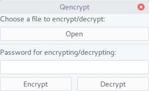

#About
Qencrypt is a small gui program which helps you encrypt small files.
It uses nacl's 'secretbox' for encryption and https://github.com/andlabs/ui for the ui.

#Screenshot

#Usage

1. Open a file which you want to encrypt or decrypt using the 'Open' button.
2. Type in a password in the password field which you want to use to encrypt or decrypt the file.
3. Choose whether you want to encrypt or decrypt the file by clicking the 'Encrypt' or 'Decrypt' buttons.

Thats it!

#License
GPLv3. For more information, please see the LICENSE file.
